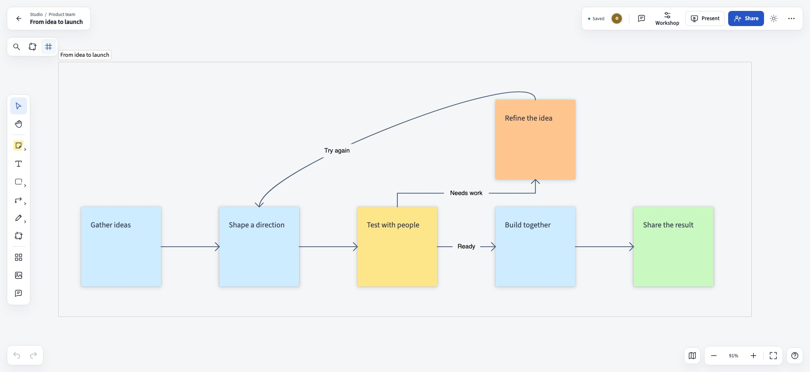
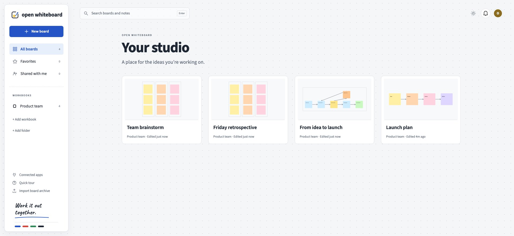
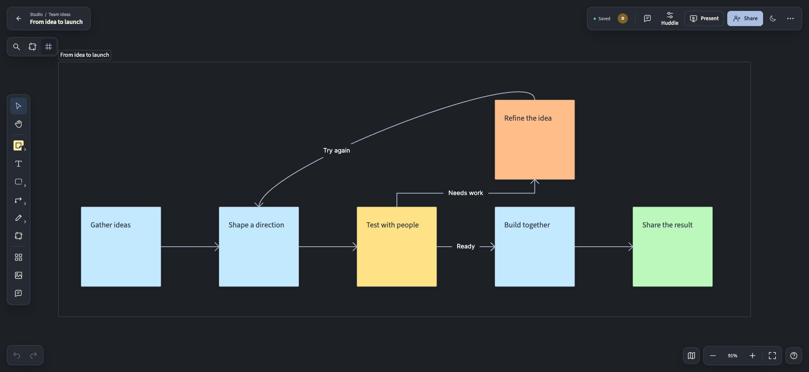
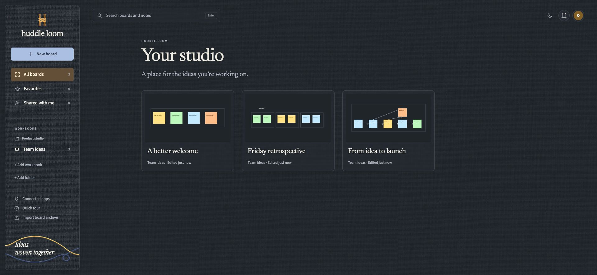
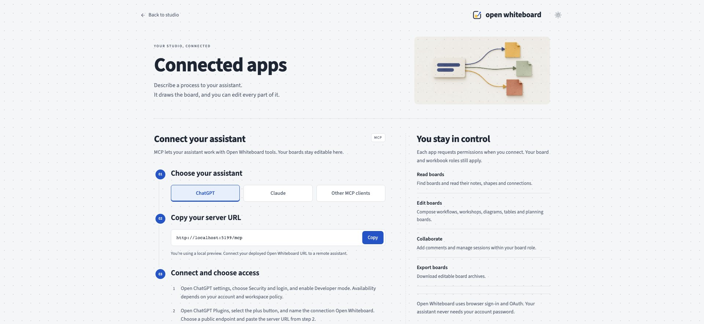

<p align="center"></p>
<h1 align="center">Open Whiteboard</h1>
<p align="center">Work it out together.</p>

Open Whiteboard is a whiteboard you host yourself. Put sticky notes and sketches on a shared board, draw the arrows between them, and work through the problem with your team as it happens. You can also connect an AI assistant over MCP and have it turn a written description into notes, shapes and arrows that you keep editing by hand.



## What's inside

- An infinite canvas with sticky notes, shapes, drawing, text, frames, documents, tables, and images.
- Bound arrows that follow objects when you move them. Drag tools onto the board or add a connected next step.
- Live collaboration, comments, guest links, presentation, timers, and voting.
- A Studio that organizes boards into folders and workbooks. Start a board from a template, and restore an earlier version from its history.
- Light and dark themes, guides that point to the controls you need, and keyboard shortcuts.
- Local accounts, passkeys or authenticator verification, invitations, recovery, and administration. Email and external sign-in providers are optional.
- An OAuth-protected MCP server with 21 tools for workflows, workshops, diagrams, search, images, and board editing.
- Native archives that keep boards editable, plus image exports.

This is the first public release. Cloudflare is the primary hosting path. The Node package has been tested locally and in a GoDaddy preview; published GoDaddy deployments still need the checks in the hosting guide. Please report bugs and avoid using an untested installation as the only copy of important work.

## Host on Cloudflare

[](https://deploy.workers.cloudflare.com/?url=https://github.com/sportwhiz/open-whiteboard)

Choose a private setup password in the deployment form. The deployment creates the storage and installation keys. Open the app, enter that password, and create your administrator account. You can invite people before setting up email.

You need a Cloudflare account with Workers Paid and R2 enabled. Cloudflare Access is optional. Users sign in to Open Whiteboard with their own accounts; a GitHub sign-in provider is not required.

[Cloudflare installation guide](docs/cloudflare-git-deploy.md) covers the deploy form, existing Workers Builds connections, previews, email, and custom domains.

## Host on GoDaddy Node.js

Download [open-whiteboard-node.zip](https://github.com/sportwhiz/open-whiteboard/releases/latest/download/open-whiteboard-node.zip), create a Node.js Hosting app with managed MySQL, and upload the ZIP. Add a private `SETUP_PASSWORD` in GoDaddy's secrets. After GoDaddy creates the app, open its Preview link and copy that HTTPS address into `AUTH_ORIGIN` in Preview settings. Restart and create your administrator account. GoDaddy handles dependencies and database connections; the app creates its tables and keys.

[GoDaddy installation guide](docs/godaddy-nodejs-installation.md) includes the exact settings and the differences between Preview and Publish. Other Node hosts can use the same package with a full MySQL catalog. The [Node adapter](apps/web/src/node) is a separate source folder; it shares the editor and application services with Cloudflare.

## Try it locally

Use Node 22.16 or newer within Node 22, and pnpm 10.30.3.

```sh
corepack enable
pnpm install --frozen-lockfile
pnpm --filter @whiteboard/web exec wrangler d1 migrations apply CATALOG --local --config wrangler.local.jsonc
pnpm dev
```

Open the URL Vite prints. Local development uses a sample owner account and stores data on your computer. Never deploy `wrangler.local.jsonc`: it bypasses sign-in for local work. To test real onboarding, follow [Development](docs/development.md).

## A few things you can ask your assistant

After connecting `https://YOUR_APP/mcp` in a remote MCP client:

> Map our support workflow. A request is triaged, assigned, investigated, and resolved. If more information is needed, return it to the requester. Use sticky notes, label the branches, and connect every step.

> Create a retrospective with three groups: what helped, what slowed us down, and what we should try next.

> Read this board, group related ideas, and keep the original notes editable.

[Connected apps and MCP](docs/mcp.md) explains consent, scopes, tools, and prompts. Availability of remote connectors depends on the assistant account you use.

<details>
<summary>More screenshots</summary>






Screenshots use sample boards. They contain no production accounts or credentials.
</details>

## Documentation

| Guide | What it covers |
| --- | --- |
| [Using Open Whiteboard](docs/using-open-whiteboard.md) | Boards, sharing, templates, and collaboration |
| [Cloudflare](docs/cloudflare-git-deploy.md) | Deployment and first owner setup |
| [GoDaddy / Node.js](docs/godaddy-nodejs-installation.md) | ZIP upload, storage, and process replacement |
| [MCP](docs/mcp.md) | Connecting assistants and creating editable diagrams |
| [Administration and recovery](docs/security-operations.md) | Accounts, email, keys, and backups |
| [Updates](docs/software-updates.md) | Release checks and installation upgrades |
| [Architecture](docs/architecture.md) | Shared application and hosting adapters |
| [Development](docs/development.md) | Builds, tests, and packaging |

## Contribute or get help

Open a [bug report or feature request](https://github.com/sportwhiz/open-whiteboard/issues). For code changes, see [Contributing](CONTRIBUTING.md). Report security problems privately using the process in [SECURITY.md](SECURITY.md).

Open Whiteboard's own code is [MIT licensed](LICENSE). Libraries and fonts keep their licenses, including MPL-2.0 components and OFL fonts. See [Third-party notices](THIRD_PARTY_NOTICES.md) and [Upstream](docs/upstream.md). Open Whiteboard is an independent project; upstream maintainers do not endorse it.
