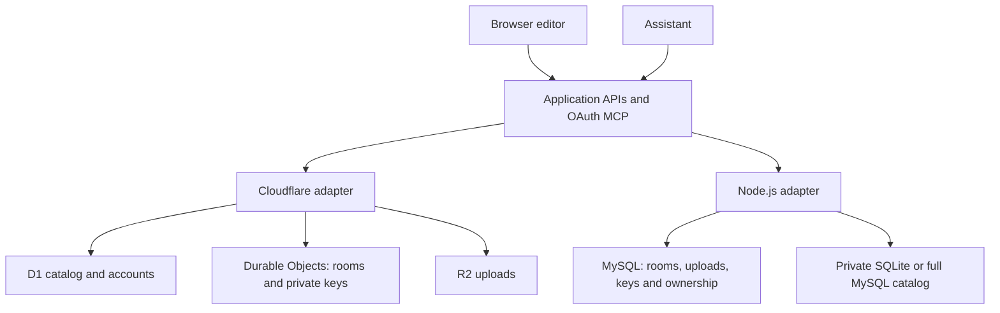

# Architecture

The browser editor and application services are shared by both hosts. Hosting adapters provide the database, storage, live-room ownership, email, and HTTP entry point.

| Area | Cloudflare | Node.js |
| --- | --- | --- |
| HTTP and assets | Worker with static assets | Node HTTP server and prebuilt assets |
| Accounts and catalog | D1 | Private SQLite on GoDaddy; MySQL option on other hosts |
| Live board state | One Durable Object per board | In-process rooms persisted to MySQL |
| Uploads | R2 | MySQL blob storage |
| Installation keys | Dedicated Durable Object | Private MySQL key records |
| Background work | Scheduled Worker | Server maintenance loop |
| Email | Cloudflare Email Service or Resend | GoDaddy gateway or TLS SMTP |
| Upgrades | Workers Builds and owner-approved release runner | Replace the dashboard ZIP |

Boards use BlockSuite's native document model and Yjs updates. Browser previews are separate from durable board state. MCP operations create the same editable elements as the editor. Native commands validate references and commit batches atomically; retries use an operation ID.

Authentication and permissions are checked at the application boundary. Resource permissions still apply to administrators and assistants. Guest links grant access to one board, rather than granting a Studio account.

## Node ownership

A Node installation runs one active application process. An advisory lock prevents a second process from serving the same installation with different in-memory board state. This is a deployment limit, not a limit on people or boards.

Separate namespaces can isolate preview and production inside a shared managed MySQL database. They also select separate private catalog directories. Changing an existing namespace selects different data; it is not a migration.

Horizontal Node scaling would require a shared room coordinator and a qualified process ownership protocol. Cloudflare already routes each board to its Durable Object. See [Node hosting](godaddy-nodejs-installation.md) before choosing rollout settings.
