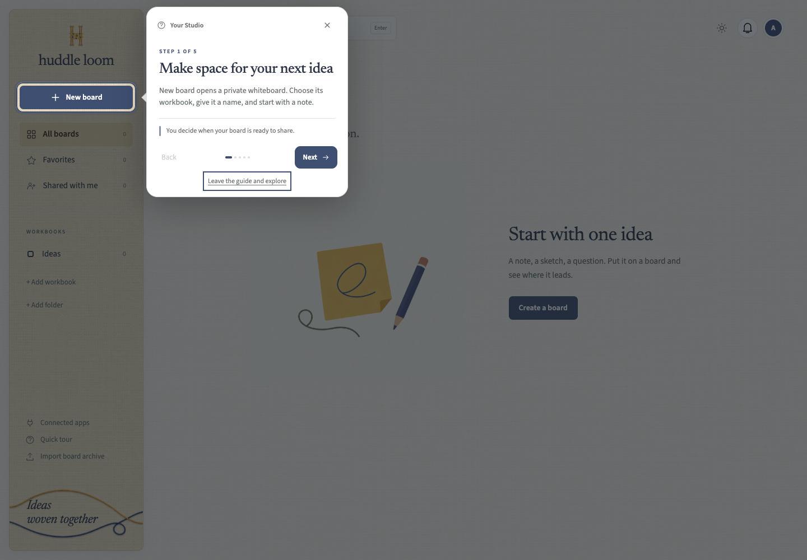

# Using Open Whiteboard

## Your Studio

The Studio holds folders, workbooks, and boards. Create a workbook for a project and give its boards names people can find. Favorites and search help you return to active work. Shared with me shows content another person has granted you access to.

Templates are starting layouts. Open **Templates** from the board toolbar, then choose a layout. It appears beside existing content and the view fits the new section. Every object remains editable; Undo removes the inserted template in one step.

- **How updates work** maps a published release through owner approval, the installer build, verification, and recovery. It explains how your repository deploys approved upstream code while keeping your Studio's data and settings.
- **50 ideas** gives you fifty blank sticky notes in a roomy grid. Write on them, move them, and group related thoughts.
- Brainstorm, Retrospective, Kanban, and Workflow offer smaller starting layouts.

A board an assistant creates starts blank unless you ask for a template.

## On the board

Drag a sticky-note or shape tool onto the canvas to place the last style you chose. You can also select a tool and click to place it. Select an object to edit its text, color, size, and other available properties.

Sticky notes have a toolbar for their color and text. Font, size, and alignment apply to the whole note. Bold, italic, underline, strikethrough, and text color apply to the words you select while editing, or to the whole note when you have selected the note itself. Select several notes to change them together. While editing, ⌘B, ⌘I, ⌘U, and ⌘⇧X (Ctrl on Windows and Linux) toggle bold, italic, underline, and strikethrough. Pasted text arrives as plain text.

Use the connected-next-step control to add a note or shape with an arrow. Bound connectors follow their objects when you move them. Frames keep sections together; documents and tables hold details that would be difficult to read on a sticky note.

Pan with the hand tool, Space and drag, or drag the empty background using the configured pointer behavior. Right-drag the empty background pans as well. Use the zoom controls to fit the board. Selection, tool, and editing shortcuts are listed in board help.

Use History in the More menu to inspect saved versions. A native archive includes editable board data and referenced uploads. An image export is useful for reading or presenting elsewhere, but does not preserve editing behavior.

## Work together

Share a workbook or a specific board with a person and choose the role they need. Viewer access is read-only. Editor access permits changes. Private board permissions can override workbook inheritance.

Comments keep discussions on the board. The Workshop panel has a timer and voting controls. A running timer remains visible after the menu closes. Presentation lets you move through board sections with less interface in the way.

For someone without an account, use [guest sharing](guest-sharing.md). A guest link is a credential: send it only to intended participants and revoke it when the session ends.

## Assistants

Open Connected apps from settings or the board menu. It shows the MCP address and a connection guide. After signing in through your assistant, review the requested scopes and selected boards or workbooks before approving.

The assistant edits native content, so you can keep refining its work by hand. Ask it to inspect a diagram, shorten crowded labels, or reorganize a workflow while preserving the existing objects. [MCP guide](mcp.md) has examples and limits.

## Find your way around

The quick guides point to the controls they describe and shade the rest of the page. Each page has its own guide: your Studio, whiteboards, Connected apps, Account and security, and each administration section.

Use **Next** and **Back** to move through a guide. **Skip tour**, Escape, and **Leave the guide and explore** close it immediately. A guide never creates a board, sends an invitation, or changes a setting for you. Your completed or skipped guides are remembered for your account; device storage also keeps them dismissed when a save cannot reach the server.

You can replay a guide with **Quick tour** in Studio navigation, Connected apps, or the settings header. On a board, open **Keyboard shortcuts** and choose **Take a quick board tour**. Guides adapt to your permissions: a viewer learns navigation and comments, while an editor sees the creation tools. Visitors using a guest link get a board guide with dismissal saved on their device; no account is created or changed. Administration guides only appear in sections your role can access.

On a small screen, a guide opens Studio navigation when needed and scrolls the highlighted control into view. If a control is unavailable, the guide explains that instead of pointing at an unrelated part of the page. Keyboard focus stays in the guide until you finish or leave it.
